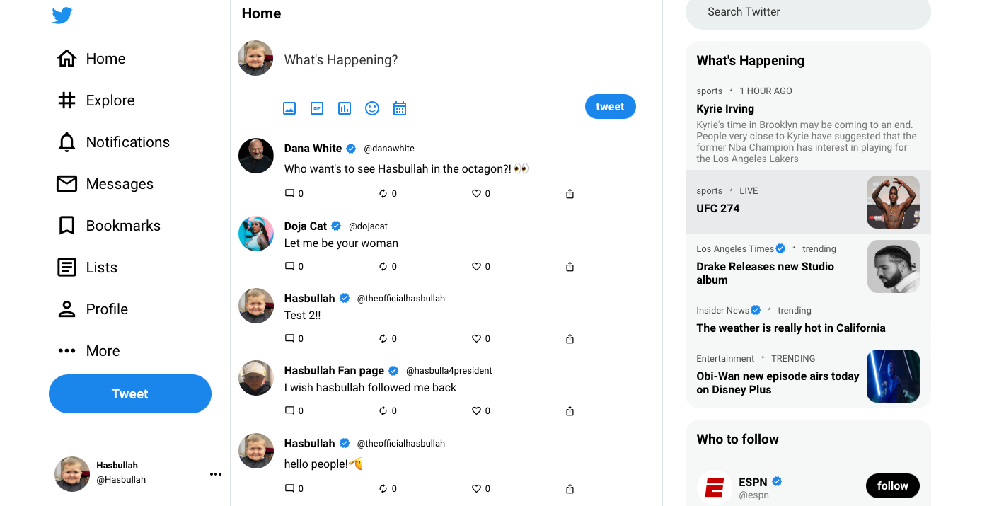

# Twitter Clone

This is a twitter clone that I have developed on my own.

## Table of contents

- [Overview](#overview)
  - [The challenge](#the-challenge)
  - [Screenshot](#screenshot)
  - [Links](#links)
- [My process](#my-process)
  - [Built with](#built-with)
  - [What I learned](#what-i-learned)
  - [Continued development](#continued-development)
  - [Useful resources](#useful-resources)
- [Author](#author)
- [Acknowledgments](#acknowledgments)

## Overview

### The challenge

I challenged myself to make a twitter clone after a video popped up about clone apps. I knew a project like this would help develop my front-end development skills. To make the project more challenging, I didn't use any resources except for when I would run into errors in which I used Google/StackOverflow to solve.

### Screenshot

### Links

- Live Site URL: [Add live site URL here](https://your-live-site-url.com)

## My process

### Built with

- CSS custom properties
- Flexbox
- Firebase
- Routers
- [React](https://reactjs.org/) - JS library
- NodeJS
- Javascript
- HTML
- CSS

### What I learned

I learned how to develop a twitter style layout which involved three columns, two of which scroll. Developing this project, I gained more confidence and skills in react. I am a lot more comfortable with jsx, state, and firebase because of this twitter clone. For a few days I was struggling to render tweet components using .map() buit I eventually got it to work. After working on this project, I can honestly say I came out a better developer.

### Continued development

I had tried using the twitter API to pull tweets for the feed but I couldn't get it to work efficently enough. In my next project, I want to for sure use an API and connect to it using some sort of authentication like an APIKEY or Bearer token.

## Author

- Website - [Sahd Khan](https://khansahd.github.io/SahdKhan-Portfolio/)
- Instagram - [@sxhd.1](https://instagram/sxhd.1)
